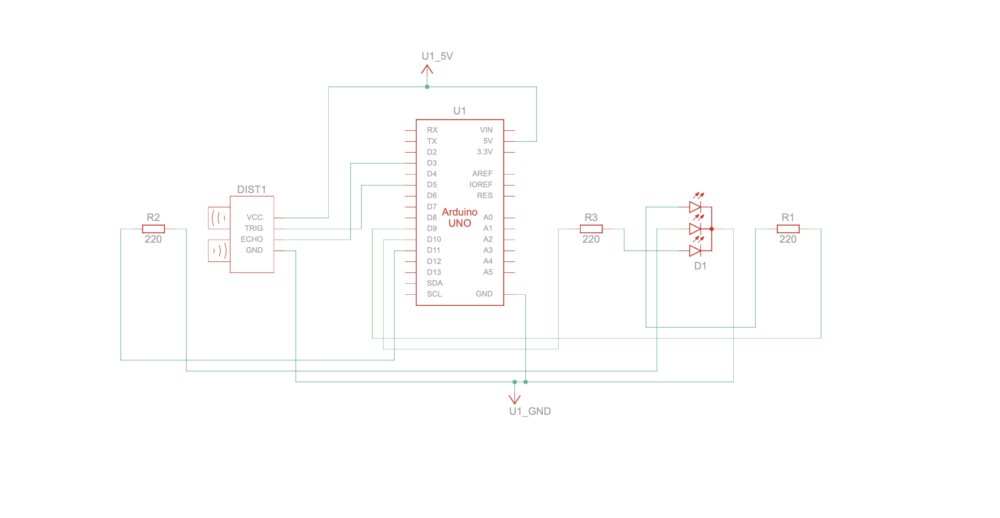
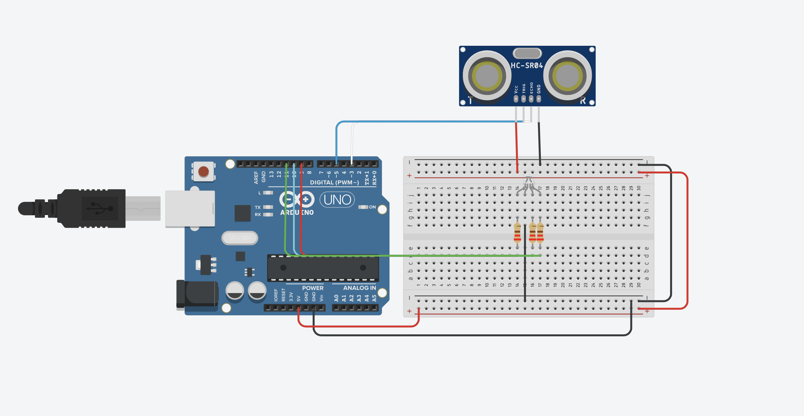
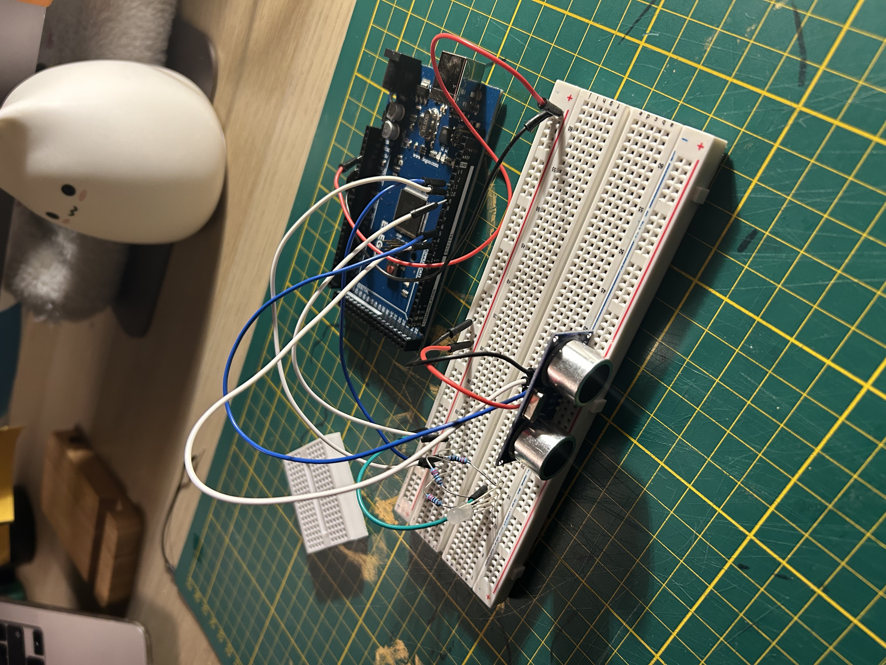
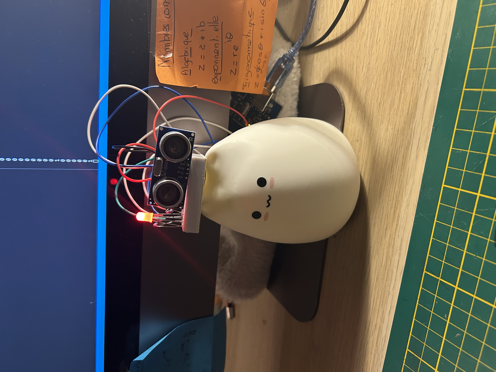

# 👁️ SmartFace Monitor (Arduino)

> 🚨 Detect when you're too close to your screen and get notified instantly!

---

## 🇫🇷 Description

SmartFace Monitor est un projet Arduino qui détecte si ton visage est trop proche d’un écran 📏.
Lorsqu’une distance critique est atteinte, une notification macOS est envoyée pour te rappeler de reculer 👀

🎯 Objectif :
Améliorer le confort visuel et sensibiliser à une bonne distance écran.

---

## ⚙️ Fonctionnalités

* 📏 Mesure de distance en temps réel (ultrason)
* 👤 Détection de proximité
* 🚨 Notification macOS automatique
* 🔔 Alerte sonore
* 🎨 LED RGB (rouge → vert selon la distance)
* 🔧 Seuil configurable

---

## 🛠️ Technologies

* Arduino (C/C++)
* Capteur ultrason (HC-SR04)
* Python 3
* pyserial
* macOS notifications (`mac_notifications`)

---

## 🔌 Schéma électronique

Exemple :





---

## 🚀 Installation

### 1. Arduino

* Connecte ton capteur HC-SR04
* Upload ton code Arduino

---

### 2. Python

```bash
python3 install -r /path/to/requirements.txt
```

---

### 3. Lancer le projet

```bash
python3 main.py
```

---

## 🧠 Fonctionnement

* L’Arduino mesure la distance 📡
* Si la distance est trop faible → envoie "1"
* Python lit la donnée 📥
* Une notification s’affiche 💻

---

## 🇬🇧 Description

SmartFace Monitor is an Arduino project that detects when your face is too close to a screen 📏.
When a critical distance is reached, a macOS notification is triggered to remind you to step back 👀

🎯 Goal:
Improve eye comfort and promote healthy screen distance habits.

---

## ⚙️ Features

* 📏 Real-time distance measurement (ultrasonic)
* 👤 Face proximity detection
* 🚨 Automatic macOS notification
* 🔔 Sound alert
* 🎨 RGB LED (red → green depending on distance)
* 🔧 Adjustable threshold

---

## 🛠️ Technologies

* Arduino (C/C++)
* Ultrasonic sensor (HC-SR04)
* Python 3
* pyserial
* macOS notifications (`mac_notifications`)

---

## 🔌 Circuit Diagram

Example:


---

## 🚀 Setup

### 1. Arduino

* Connect your HC-SR04 sensor
* Upload the Arduino code

---

### 2. Python

```bash
pip3 install pyserial mac-notifications
```

---

### 3. Run

```bash
python3 main.py
```

---

## 🧠 How it works

* Arduino measures distance 📡
* If too close → sends "1"
* Python reads data 📥
* Notification pops up 💻

---

## ✨ Demo (optional)






---

## 💡 Ideas / Improvements

* Ajouter plusieurs niveaux (safe / warning / danger)
* Afficher la distance exacte
* Support Windows/Linux
* Interface graphique

---

## ❤️ Made with Arduino & Python
